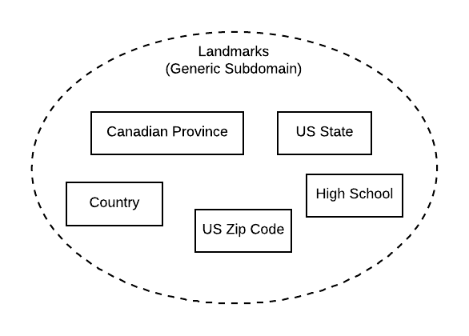

# Landmarks API

Here's a RESTful web service written using the hexagonal architectural design pattern using Lumen. We're using a MySQL backend with Redis caching.



## Use cases this microservice serves

- As a web application client, I want a list of Canadian provinces.
- As a web application client providing a slug, I want information on the specific Canadian province identified by the provided slug.
- As a web application client, I want a list of countries.
- As a web application client providing a slug, I want information on the specific country identified by the provided slug.
- As a web application client, I want a list of high schools.
- As a web application client providing a slug, I want information on the specific high school identified by the provided slug.
- As a web application client providing a search term, I want a list of high schools whose title include the provided term.
- As a web application client, I want a list of US states.
- As a web application client providing a slug, I want information on the specific US state identified by the provided slug.
- As a web application client, I want a list of US zip codes.
- As a web application client providing a slug, I want information on the specific US zip code identified by the provided slug.
- As a web application client providing a US zip code, I want the city and state for the provided US zip code.

## Requirements

- [Composer](https://getcomposer.org/)
- [CoreUtils](https://www.gnu.org/software/coreutils/) (if running OSX, install via [Homebrew](https://brew.sh/) with ```brew install coreutils``` )

## Installation

This installation document assumes you're running a standard Apache virtual host configuration under the host ```example.com```. Source repositories are stored in the ```/var/www/vhosts/example.com/source/``` directory, and the public web root is ```/var/www/vhosts/example.com/httpdocs/```. If your configuration is different, you will need to modify the paths used in these instructions :)

Let's get started!

- Clone this repository above the public web root. (for example: ```/var/www/vhosts/example.com/source/landmarks-api```)
- Fire up a terminal and run the following commands in the project source root:

```bash

cd /var/www/vhosts/example.com/source/landmarks-api

# Install composer dependencies
composer install

# Prepare the .env
cp .env.example .env
```
- Prepare the public web directory by running the following commands in the vhost root:

```bash

cd /var/www/vhosts/example.com

cp -r source/landmarks-api/public httpdocs/landmarks-api

# Get relative path to source /storage from project source root
realpath --relative-to=/var/www/vhosts/example.com/httpdocs/landmarks-api /var/www/vhosts/example.com/source/landmarks-api/storage

cd /var/www/vhosts/example.com/httpdocs/landmarks-api

# Using the relative URL generated above, place symlink to public asset storage
# example relative URL: ln -s ../../source/landmarks-api/storage
ln -s <relative url goes here> storage 

# Ensure /storage has correct permissions
sudo setfacl -m u:apache:rwx -R /var/www/vhosts/example.com/source/landmarks-api/storage
sudo setfacl -m d:g:apache:rwx /var/www/vhosts/example.com/source/landmarks-api/storage
sudo chmod -R 775 /var/www/vhosts/example.com/source/landmarks-api/storage

```

- Create a database for this application. I'd suggest calling it ```landmarks_api```.

- Open up the ```.env``` file in the project source root and make the following configuration updates:
    - Environment variable (local, testing, production)
    - MySql configuration
    - sqlite configuration (```DB_DATABASE_TESTING=/var/www/vhosts/example.com/source/landmarks-api/database/database.sqlite```)
    - Redis configuration
    - Change ```CACHE_DRIVER=redis``` if you have a redis server available
    - Modify ```APP_WEB_ROOT``` to match the web root path you chose in the previous step (ie: ```APP_WEB_ROOT="/landmarks-api/"```)
    - Modify ```APP_URL``` to match the full web path (ie: ```APP_URL="https://example.com/landmarks-api/"```)

- Open up the web root loader in a text editor ```/var/www/vhosts/example.com/httpdocs/landmarks-api/index.php```
    - Modify the ```index.php``` to correctly reference the bootstrap file correctly. For example:

```php
$app = require $_SERVER['DOCUMENT_ROOT'] . '/../source/landmarks-api/bootstrap/app.php';
```

- Now that the application is configured, we need to execute a few more commands. Open a terminal again:

```bash
cd /var/www/vhosts/example.com/source/landmarks-api

# Migrate and seed the database
php artisan migrate --seed
```

- Now we'll need to generate the documentation. You'll note that each controller has a docblock following the SwaggerLume convention exemplified [here](https://github.com/zircote/swagger-php/blob/master/Examples/petstore.swagger.io/controllers/PetController.php). Make sure the ```path``` is correct! So if you didn't deploy this application to ```/landmarks-api``` on your web server, you'll need to update the docblock in the controllers to match. Then run the following commands:

```bash
cd /var/www/vhosts/example.com/source/landmarks-api

php artisan swagger-lume:generate
```

- These commands publish developer documentation to the web root (/landmarks-api). You should fire this up in a web browser and ensure that the example REST requests are working. 

## Documentation

Documentation for this microservice was generated using [SwaggerLume](https://github.com/DarkaOnLine/SwaggerLume). You can refer to the documentation there for instructions on regenerating the OpenAPI-style api documentation.

## Hexagonal Architecture

This is also known as the Ports and Adapters architectural design pattern.

The Hexagonal architectural design pattern aims to decouple the business logic from the storage, notification, and persistence mechanisms of the application. So basically, this code should be relatively easy to port into some different framework or be used with some different database. So then, the framework facilitates interaction with our input port (REST API over HTTP) and our persistence port (MySQL with Redis caching). Everything else is decoupled from the framework.

- Business logic classes are stored in ```Interactors/```
- User edge classes are stored in ```Http/```
- Persistence edge classes are stored in ```Repositories/```

So basically the Lumen controller passes the chosen Repository Object to an Interactor Object. This way we have decoupled our domain code from the framework.
	
## A bit of logical explanation

Because this is a microservice modelled in the Domain-Driven Design paradigm, there are some quirks that might need explanation. Our model of ```Canadian Provinces``` is a *value object*, so we don't reference by any identifier other than its value. So this web service only pulls information concerning a specific ```Canadian Province``` by its value (in this case--a slug). 

Also, the method that returns all ```Canadian Provinces``` only returns the **active** affiliations. Whereas the method that returns information on only one ```Canadian Province``` will return an inactive one.

## Developer Testing

There is a bit more configuration necessary to run tests. 

Fire up a terminal, navigate to the vhost root, and run the following commands (some require modification):

```bash
cd /var/www/vhosts/example.com/source/landmarks-api

# Prepare the .env
cp .env.testing.example .env.testing
```

- Open up the ```.env.testing``` file and make the following configuration updates:
    - sqlite configuration (```DB_DATABASE_TESTING=/var/www/vhosts/example.com/source/landmarks-api/database/database.sqlite```)
    - Modify ```APP_WEB_ROOT``` to match the web root path you chose in the previous step (ie: ```APP_WEB_ROOT="/landmarks-api/"```)
    - Modify ```APP_URL``` to match the full web path (ie: ```APP_URL="https://mkt-api.local.gcu.edu/landmarks-api/"```)
    
Now you can begin running tests and creating coverage reports and testing documentation

```bash
# Navigate to project root
cd /var/www/vhosts/example.com/source/landmarks-api

# Running tests
vendor/bin/phpunit --debug --verbose

# Running tests and building documentation
vendor/bin/phpunit --testdox-html storage/phpunit/index.html --coverage-html=storage/phpunit/coverage.html
```

You should be able to access the testing documentation now at in the web browser as ```storage/phpunit``` and ```storage/phpunit/coverage.html```. If you do end up generating this coverage documentation, don't leave it on the production server, ya turkey!

## Lumen PHP Framework

[](https://travis-ci.org/laravel/lumen-framework)
[](https://packagist.org/packages/laravel/lumen-framework)
[](https://packagist.org/packages/laravel/lumen-framework)
[](https://packagist.org/packages/laravel/lumen-framework)
[](https://packagist.org/packages/laravel/lumen-framework)

## Lumen Documentation

Documentation for the framework can be found on the [Lumen website](https://lumen.laravel.com/docs).

## License

The Lumen framework is open-sourced software licensed under the [MIT license](https://opensource.org/licenses/MIT).
